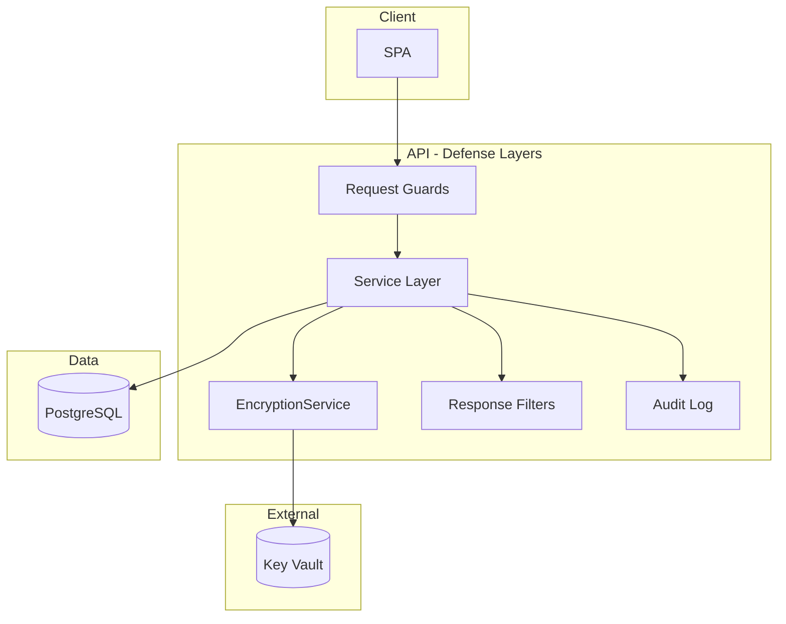

# PII/PCI Protection System Design
## Application-Layer Encryption Architecture

**Version:** 1.0  
**Audience:** Security Architects, System Architects, Senior Developers

---

## Executive Summary

This design protects PII and PCI data through application-layer encryption, rendering sensitive data cryptographically unreadable at rest, in backups, and in logs—even to database administrators.

**Core Pattern:**
```
One PII Field → Three Database Columns
├─ encrypted: Base64([version|IV|ciphertext+tag])  // AES-256-GCM
├─ hash: HMAC(pepper, normalized_value)            // Indexed search
└─ last4: "6789"                                   // Masked display
```

**Key Decisions:**
- Application-layer encryption separates keys (Key Vault) from data (database)
- AES-256-GCM with AAD provides authenticated encryption and field binding
- HMAC hashing enables equality search without decryption
- Versioned keys enable zero-downtime rotation
- Defense-in-depth: encryption + guards + filters + sanitizers + audit

**Compliance:** PCI DSS 3.2.1 (Req 3.4, 3.5, 10.1) | GDPR Article 32

---

## 1. Problem Statement

### 1.1 Requirements

Protect Social Security Numbers, bank account numbers, and payment card numbers (PAN). Data must be:

1. **Cryptographically unreadable** everywhere—databases, backups, logs, exports
2. **Searchable without decryption** for customer service
3. **Displayable masked** by default (`***-**-6789`)
4. **Evolvable** without data rewrites

### 1.2 Threat Model

| Attack Vector | Defense |
|---------------|---------|
| Database breach | Keys external; database has only ciphertext |
| Insider threat (DBA) | DBAs cannot read plaintext without app access |
| Backup exposure | Backups encrypted; keys separate |
| Log leaks | Sanitizers redact before logging |
| API injection | Guards reject PII in URLs/headers |
| Accidental exposure | Filters block plaintext in responses |

### 1.3 Compliance

| Standard | Requirement | Implementation |
|----------|-------------|----------------|
| **PCI DSS 3.4** | Render PAN unreadable | AES-256-GCM at application layer |
| **PCI DSS 3.5** | Key management | Versioned keys in Key Vault |
| **GDPR Art. 32** | Technical measures + pseudonymization | Encryption + HMAC hashing |
| **PCI DSS Req 10** | Audit trails | Immutable log |

---

## 2. Design Rationale

### 2.1 Application-Layer vs Database Encryption

**Trust Boundary Separation:**

```
Application-Layer                    Database TDE
┌────────────────────┐              ┌────────────────────┐
│ Application        │              │ Application        │
│ ├─ Keys: Key Vault │✓             │ └─ Plaintext       │✗
│ └─ Data: Plaintext │              ├────────────────────┤
├────────────────────┤              │ Database           │
│ Database           │              │ ├─ Keys + Data     │✗
│ └─ Data: Encrypted │✓             │ └─ Plaintext       │✗
└────────────────────┘              └────────────────────┘

Two trust domains                    Single trust domain
```

| Approach | Key Separation | Protects vs DBA | Protects vs SQL Injection | Field-Level | Decision |
|----------|---------------|----------------|---------------------------|-------------|----------|
| PostgreSQL TDE | ❌ | ❌ | ❌ | ❌ | Insufficient |
| pgcrypto | ❌ | ❌ | ❌ | ⚠️ | Poor |
| Application-layer | ✅ | ✅ | ✅ | ✅ | **Selected** |

**Benefits:**
- Independent access controls for keys and data
- Field-level granularity with context binding (AAD)
- Database vendor independence
- Zero-downtime key rotation via versioning
- Direct PCI compliance

### 2.2 Three-Column Pattern

| Pattern | Search | Display | Storage | Decrypt Rate | Decision |
|---------|--------|---------|---------|--------------|----------|
| Encrypted only | Decrypt all | Decrypt | 2x | 100% | ❌ |
| Encrypted + Hash | Indexed | Decrypt | 3x | 90% | ⚠️ |
| Encrypted + Hash + Last4 | Indexed | No decrypt | 3.5x | <10% | ✅ |

Three columns eliminate decryption for 90%+ of operations.

### 2.3 AES-GCM vs AES-CBC

| Property | AES-GCM | AES-CBC + HMAC |
|----------|---------|----------------|
| Operations | Single AEAD | Encrypt then MAC |
| Authentication | Built-in | Separate |
| AAD Support | Native | Custom |
| Complexity | Lower | Higher |

**Decision:** AES-GCM provides authenticated encryption with additional data (AEAD) in one primitive.

### 2.4 HMAC vs Order-Preserving Encryption

**Order-Preserving Encryption:**
- Enables range queries
- Leaks order information
- Vulnerable to frequency analysis

**HMAC:**
- Equality only
- No information leakage beyond equality
- Simple, proven

**Decision:** HMAC sufficient; range queries not required.

---

## 3. Architecture

### 3.1 System Context

```
┌─────────┐  HTTPS  ┌──────────┐  TLS   ┌──────────┐
│ React   ├────────▶│ Spring   ├───────▶│ PostgreSQL│
│ SPA     │         │ Boot API │        │ Database  │
└─────────┘         └────┬─────┘        └───────────┘
                         │ HTTPS
                         ▼
                    ┌─────────┐
                    │ Azure   │
                    │ Key     │
                    │ Vault   │
                    └─────────┘
```

### 3.2 Component Design



### 3.3 Data Flow

**Write:**
```
Client POST → Guard validates → Service: Normalize → HMAC → Encrypt
                                      → Store (encrypted, hash, last4)
                                      → Audit
                                      → Response filter
                                      → Return masked
```

**Search:**
```
Client POST → Normalize → HMAC → Query WHERE hash = ?
                                → Return last4 (no decrypt)
                                → Audit
```

**Decrypt (authorized):**
```
Authorization checks → Fetch encrypted → Parse version → Get key
                                      → AES-GCM decrypt
                                      → Audit
```

---

## 4. Cryptographic Design

### 4.1 Algorithm

**AES-256-GCM** (Galois/Counter Mode)
- Key: 256 bits
- IV: 96 bits (random per encryption)
- Tag: 128 bits (authentication)
- AAD: Field context binding

### 4.2 Ciphertext Format

```
┌─────────┬─────────┬──────┬─────────────────┐
│Ver Len  │ Version │  IV  │ Ciphertext+Tag  │
│(1 byte) │(N bytes)│(12 B)│  (var + 16 B)   │
└─────────┴─────────┴──────┴─────────────────┘
```

**Example:** `[17][v2-prod-20241015][12 IV bytes][ciphertext][16 tag bytes]`

**Benefits:**
- Self-describing (version embedded)
- Forward compatible
- Tamper-evident

### 4.3 Additional Authenticated Data (AAD)

**Format:** `"{table}.{column}"` (e.g., `"users.ssn"`)

**Purpose:** Cryptographically bind ciphertext to field context

**Security:** Prevents field substitution attacks
```
Attack: Copy users.ssn_encrypted → users.account_number_encrypted
Result: ❌ Authentication failure (AAD mismatch)
```

### 4.4 Search Hash

**Algorithm:** `Base64(HMAC-SHA256(pepper, normalized_value))`

**Properties:**
- Deterministic (enables equality search)
- One-way (cannot reverse)
- Keyed (pepper prevents rainbow tables)

**Limitations (by design):**
- ✅ Equality: `WHERE hash = ?`
- ❌ Range: `WHERE value BETWEEN`
- ❌ Partial: `WHERE value LIKE`

### 4.5 Masked Display

**Storage:** Last 4 digits in separate column

**Formats:** `***-**-6789`, `******5432`, `**** **** **** 1111`

**Benefit:** 90%+ operations use last4 without decryption

---

## 5. Key Management

### 5.1 Azure Key Vault Design

**Secrets:**

| Name | Type | Purpose |
|------|------|---------|
| `pii-dek-{version}` | 256-bit AES | Encrypt/decrypt |
| `pii-hmac-pepper-{version}` | 512-bit secret | Search hashes |

**Examples:** `pii-dek-v1-prod-20240101`, `pii-dek-v2-prod-20241015`

**Configuration:**
- Soft-delete: 90-day retention
- Purge protection: Enabled
- Access: Managed identity, Get/List only
- Network: Private endpoints

### 5.2 Key Rotation

**Zero-Downtime Strategy:**

```
1. Create new key version in Key Vault
2. Update application config (current-version=v3)
3. Rolling deployment
   ├─ New writes use v3
   └─ Old reads use v1/v2 (auto-detected from ciphertext)
4. Optional: Background re-encryption
```

**Benefits:**
- No service interruption
- Old keys remain accessible
- Multiple versions coexist

**Pepper Rotation:** Requires re-hashing all data
```
Strategy: Add hash_version column → Dual-read period →
         Lazy migration on updates → Cutover
```

---

## 6. Security Controls

### 6.1 Defense-in-Depth

| Layer | Control | Purpose |
|-------|---------|---------|
| L1 | Request Guards | Block PII in URLs/headers |
| L2 | Encryption | Render data unreadable |
| L3 | Response Filters | Block plaintext in output |
| L4 | Log Sanitizers | Redact from logs |
| L5 | Audit Log | Immutable access record |
| L6 | Access Controls | RBAC enforcement |

**Independence:** Each layer functions independently; failure of one doesn't compromise others.

### 6.2 Request Guards

**Policy:** No PII in HTTP URLs or custom headers

**Rationale:** URLs logged by proxies, gateways, browsers, analytics

**Enforcement:**
- Detect patterns (SSN, account, PAN) in query strings
- Reject with HTTP 400
- Require POST body for PII

### 6.3 Response Filters

**Policy:** No plaintext PII fields in API responses

**Enforcement:**
- Parse outbound JSON
- Reject forbidden field names (`ssn`, `accountNumber`, `pan`)
- Allow only masked fields (`ssnMasked`)
- Block with HTTP 500 if violated

### 6.4 Log Sanitizers

**Policy:** No PII in application logs

**Scope:** Application logs, exceptions, MDC, SQL logs

**Redaction:** Replace patterns with masks (`***-**-****`)

### 6.5 Immutable Audit Log

**Schema:**
```
timestamp, user_id, action, entity_type, entity_id, 
fields_accessed[], purpose, outcome
```

**Immutability:** PostgreSQL rules prevent UPDATE/DELETE

**Critical:** Never log actual PII values—only access metadata

---

## 7. Data Model

### 7.1 Schema

```sql
CREATE TABLE users (
    id BIGSERIAL PRIMARY KEY,
    email VARCHAR(255) NOT NULL UNIQUE,
    
    -- Three-column pattern per PII field
    ssn_encrypted TEXT,
    ssn_hash VARCHAR(64) NOT NULL,
    ssn_last4 VARCHAR(4),
    
    account_number_encrypted TEXT,
    account_number_hash VARCHAR(64),
    account_number_last4 VARCHAR(4),
    
    pan_encrypted TEXT,
    pan_hash VARCHAR(64),
    pan_last4 VARCHAR(4)
);

-- Index hash columns for search
CREATE UNIQUE INDEX idx_users_ssn_hash ON users(ssn_hash);
CREATE INDEX idx_users_account_hash ON users(account_number_hash);
CREATE INDEX idx_users_pan_hash ON users(pan_hash);

-- Audit log
CREATE TABLE audit_log (
    id BIGSERIAL PRIMARY KEY,
    timestamp TIMESTAMPTZ DEFAULT CURRENT_TIMESTAMP NOT NULL,
    user_id VARCHAR(100) NOT NULL,
    action VARCHAR(50) NOT NULL,
    entity_type VARCHAR(50) NOT NULL,
    entity_id BIGINT,
    fields_accessed TEXT[],
    purpose TEXT NOT NULL,
    outcome VARCHAR(20) NOT NULL
);

-- Immutability
CREATE RULE audit_log_no_update AS ON UPDATE TO audit_log DO INSTEAD NOTHING;
CREATE RULE audit_log_no_delete AS ON DELETE TO audit_log DO INSTEAD NOTHING;
```

### 7.2 Column Design

| Column | Type | Purpose | Indexed |
|--------|------|---------|---------|
| `*_encrypted` | TEXT | Base64 ciphertext | No |
| `*_hash` | VARCHAR(64) | HMAC for search | Yes |
| `*_last4` | VARCHAR(4) | Masked display | No |

---

## 8. Extension Patterns

### 8.1 Adding Fields

**Template:**
1. Database: Add three columns
2. AAD: Define `"{table}.{field}"`
3. Guards: Add detection pattern
4. Filters: Add forbidden field name

### 8.2 Multi-Tenant

**Option 1 - Tenant-Specific Keys:**
```
Keys: pii-dek-{tenant_id}-{version}
AAD: "{tenant_id}.{table}.{column}"
Pro: Complete isolation
Con: More key management
```

**Option 2 - Shared Keys:**
```
Keys: pii-dek-{version}
AAD: "{tenant_id}.{table}.{column}"
Pro: Simpler management
Con: Isolation via AAD only
```

### 8.3 Data Warehouse

| Pattern | Security | Usability |
|---------|----------|-----------|
| Masked export | High | Limited |
| Tokenization | High | Good |
| Secure enclave | Medium | Good |

---

## 9. Compliance Mapping

### 9.1 PCI DSS

| Requirement | Design Element |
|-------------|----------------|
| **3.4** Render PAN unreadable | AES-256-GCM |
| **3.5** Key management | Key Vault + versioning |
| **3.5.2** Key strength ≥112-bit | 256-bit AES |
| **3.5.3** Keys separate from data | Key Vault ≠ PostgreSQL |
| **10.1** Audit trail | Immutable audit_log |

### 9.2 GDPR

| Article | Design Element |
|---------|----------------|
| **32(1)(a)** Pseudonymization | HMAC hashing |
| **32(1)(a)** Encryption | AES-256-GCM |
| **32(1)(b)** Confidentiality & integrity | AEAD |
| **33/34** Breach notification | Audit logs for forensics |

---

## 10. Design Validation

**Cryptography:**
- ✅ NIST-approved algorithms
- ✅ Random IV per encryption
- ✅ Authentication tag
- ✅ AAD context binding
- ✅ Versioned keys

**Key Management:**
- ✅ External to database
- ✅ Managed identity
- ✅ Least privilege
- ✅ Soft-delete + purge protection
- ✅ Zero-downtime rotation

**Data Protection:**
- ✅ Three-column optimization
- ✅ HMAC pepper
- ✅ Indexed search
- ✅ Masked display

**Defense-in-Depth:**
- ✅ Request guards
- ✅ Response filters
- ✅ Log sanitizers
- ✅ Immutable audit
- ✅ Independent layers

**Compliance:**
- ✅ PCI DSS 3.4, 3.5, 10.1
- ✅ GDPR Article 32

---

## Appendix: Glossary

| Term | Definition |
|------|------------|
| **AAD** | Additional Authenticated Data - context bound to ciphertext |
| **AEAD** | Authenticated Encryption with Associated Data |
| **DEK** | Data Encryption Key - stored in Key Vault |
| **GCM** | Galois/Counter Mode - AEAD for AES |
| **HMAC** | Hash-based Message Authentication Code |
| **IV** | Initialization Vector - random per encryption |
| **Pepper** | Secret for HMAC - prevents rainbow tables |
| **PII** | Personally Identifiable Information |

---

**Document Status:** Design Approved  
**Version:** 1.0
