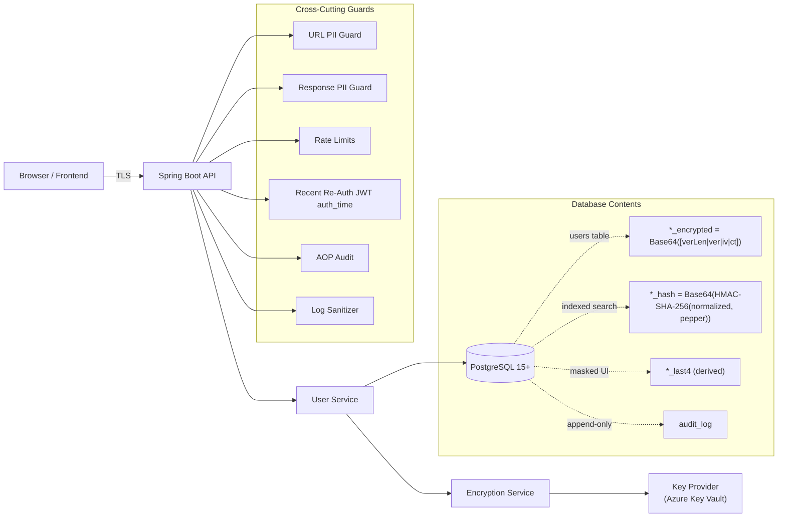
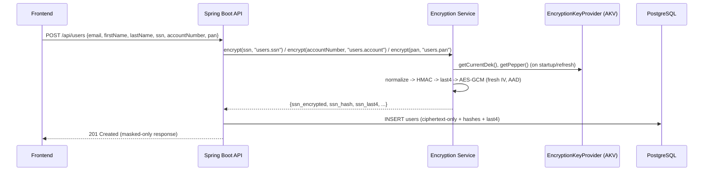
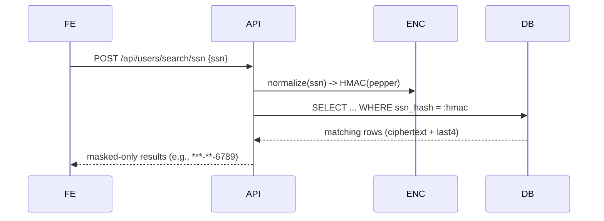

# Overall Design

Companion doc: **Key Management SOP (Option A: on-demand historical key fetch)**

---

## 1) What we’re building (goals)

* **Protect PII/PCI** with **application-level field encryption** (stronger than disk/TDE).
* **Zero-downtime key rotation** by embedding the **Key Vault version** inside each ciphertext.
* **Search without decrypt** using **HMAC (with a secret “pepper”)** over *normalized* values.
* **Masked-only UX** using **derived last-4** (no decrypt for default UI).
* **Defense-in-depth**: URL/response PII guards, recent re-auth for changes, rate limits, immutable auditing, log sanitization.
* **Least privilege**: Keys live in **Azure Key Vault (AKV)**; app has read-only (`get`, `list`) to secrets.

> Plain English: the database holds **ciphertext**, a **search hash**, and **last-4**. The app can decrypt (if necessary). Each ciphertext carries **which key version** to use.

---

## 2) Architecture at a glance




---

## 3) Data model & SQL (with comments)

### 3.1 `users` table

```sql
-- V1__create_users.sql
CREATE EXTENSION IF NOT EXISTS "uuid-ossp";

CREATE TABLE users (
  id                         UUID PRIMARY KEY DEFAULT uuid_generate_v4(),

  -- Non-sensitive attributes
  email                      VARCHAR(255) NOT NULL UNIQUE,
  first_name                 VARCHAR(100),
  last_name                  VARCHAR(100),

  -- SENSITIVE FIELDS (ciphertext-only pattern)
  -- Each encrypted column stores Base64 of a binary header: [verLen|ver|iv|ct]
  --   verLen: 1 byte (0..255), length in bytes of 'ver' (the AKV secret version)
  --   ver   : UTF-8 bytes of the AKV version string (e.g., "ee7f0a1c-...")
  --   iv    : 12-byte random IV (GCM nonce), unique per encryption
  --   ct    : AES-GCM ciphertext + 16-byte authentication tag
  ssn_encrypted              TEXT,             -- Base64([verLen|ver|iv|ct])
  account_number_encrypted   TEXT,             -- Base64([verLen|ver|iv|ct])
  pan_encrypted              TEXT,             -- Base64([verLen|ver|iv|ct])

  -- SEARCH HASHES (HMAC-SHA-256 over normalized digits-only value, with 'pepper' key)
  -- Stored as Base64-encoded 32-byte HMAC. Indexed for equality search; no decrypt required.
  ssn_hash                   VARCHAR(64),
  account_number_hash        VARCHAR(64),
  pan_hash                   VARCHAR(64),

  -- MASKED DISPLAY (derived last-4 at write time; avoids decrypt for UI)
  ssn_last4                  VARCHAR(4),
  account_number_last4       VARCHAR(4),
  pan_last4                  VARCHAR(4),

  created_at                 TIMESTAMPTZ NOT NULL DEFAULT CURRENT_TIMESTAMP,
  updated_at                 TIMESTAMPTZ NOT NULL DEFAULT CURRENT_TIMESTAMP
);

-- Indexes only on the hash columns for search
CREATE INDEX idx_users_ssn_hash      ON users(ssn_hash);
CREATE INDEX idx_users_account_hash  ON users(account_number_hash);
CREATE INDEX idx_users_pan_hash      ON users(pan_hash);

-- Helpful non-sensitive queries
CREATE INDEX idx_users_email         ON users(email);
```

> Tip: **never** add plaintext columns like `ssn`. We only store:
>
> * `*_encrypted` (Base64 header + ct)
> * `*_hash` (HMAC for search)
> * `*_last4` (for masked display)

### 3.2 `audit_log` (append-only)

```sql
-- V1__create_audit_log.sql
CREATE TABLE audit_log (
  id            BIGSERIAL PRIMARY KEY,
  event_id      UUID NOT NULL DEFAULT uuid_generate_v4(),
  event_time    TIMESTAMPTZ NOT NULL DEFAULT CURRENT_TIMESTAMP,

  request_id    VARCHAR(64),
  user_id       VARCHAR(128) NOT NULL,           -- actor (subject)
  purpose       VARCHAR(64),                      -- onboarding/support/compliance/etc.
  action        VARCHAR(32) NOT NULL,             -- CREATE/READ/UPDATE/DELETE/SEARCH
  entity_type   VARCHAR(64) NOT NULL,             -- "User"
  entity_id     VARCHAR(128),                     -- e.g., users.id
  fields_accessed TEXT[],                         -- ["ssn", "pan"] or ["masked_only"]
  ip_address    INET,
  user_agent    TEXT,

  success       BOOLEAN NOT NULL DEFAULT TRUE,
  error_code    VARCHAR(64),
  duration_ms   INTEGER
);

-- Query helpers
CREATE INDEX idx_audit_time            ON audit_log(event_time);
CREATE INDEX idx_audit_user            ON audit_log(user_id);
CREATE INDEX idx_audit_entity          ON audit_log(entity_type, entity_id);
CREATE INDEX idx_audit_action          ON audit_log(action);

-- Append-only (block UPDATE/DELETE)
REVOKE UPDATE, DELETE ON audit_log FROM PUBLIC;
CREATE RULE audit_log_no_update AS ON UPDATE TO audit_log DO INSTEAD NOTHING;
CREATE RULE audit_log_no_delete AS ON DELETE TO audit_log DO INSTEAD NOTHING;
```

> Tip: **Append-only** means: once an audit row is written, it cannot be changed or removed.

### 3.3 (Optional) DDL guard to block plaintext columns

> Advanced (optional): a Postgres **event trigger** that inspects new columns and rejects names like `ssn`, `account_number`, `pan` unless they follow the encrypted pattern. This is a strong “seatbelt” in addition to code reviews and CI checks.

---

## 4) Cryptography (how & why)

### 4.1 Algorithms & materials

* **Encryption**: **AES-256-GCM** (AEAD: authenticated encryption)
* **IV/Nonce**: 12 random bytes per encryption (never reuse with the same key)
* **AAD (Additional Authenticated Data)**: a stable label per field (e.g., `"users.ssn"`, `"users.account"`, `"users.pan"`)

    * Purpose: binds ciphertext to its **schema context**; wrong AAD → decryption fails
* **Header** stored in DB (Base64 of raw bytes):

  ```
  [ verLen ][ ver... ][ iv... ][ ct... ]
    1 B      verLen B   12 B     N B
  ```

    * `ver` is the **AKV secret version** of the **current DEK** used to encrypt
* **Search**: **HMAC-SHA-256** with secret **pepper** over a **normalized** value (digits-only)
* **Masking**: **derived last-4** from the normalized value

### 4.2 Normalization rules (examples)

* **SSN**: remove non-digits → must be 9 digits (e.g., `123-45-6789` → `123456789`)
* **Account Number**: remove non-digits → 10–12 digits (your domain rules)
* **PAN**: remove spaces/dashes → 16 digits (do **not** store CVV/PIN/track data)

### 4.3 Worked example (SSN)

* Plaintext: `"123-45-6789"`
* Normalize: `"123456789"`
* HMAC: `Base64(HMAC-SHA-256(pepper, "123456789"))` → `ssn_hash`
* Last-4: `"6789"` → `ssn_last4`
* Encrypt with AES-GCM:

    * `iv = random(12)`
    * `aad = "users.ssn"`
    * `ct = GCM_ENC(DEK, iv, aad, "123-45-6789")`
* Header bytes: `[verLen|ver|iv|ct]` → Base64 → `ssn_encrypted`

---

## 5) End-to-end flows (with sequence diagrams)

### 5.1 Create user (encrypt path)



**Key points**

* Plaintext lives **only** in request DTO scope; never persisted.
* AAD enforces column binding; last-4 avoids decrypt for standard UI.

### 5.2 Search by SSN (no decrypt)



### 5.3 Read old row after rotation (on-demand historical key)

```mermaid
sequenceDiagram
  FE->>API: GET /api/users/{id}
  API->>DB: SELECT * FROM users WHERE id=...
  DB-->>API: row with ssn_encrypted (Base64([verLen|ver|iv|ct]))
  API->>ENC: decrypt(ssn_encrypted, "users.ssn")
  ENC->>ENC: parse header -> ver, iv, ct
  alt ver != current
    ENC->>KP: getDekByVersion(ver)   (on-demand from AKV)
  end
  ENC->>ENC: GCM_DEC(dek, iv, aad="users.ssn", ct)  (integrity check)
  ENC-->>API: plaintext (if needed by business use case)
  API-->>FE: (normally masked-only; full reveal requires step-up auth)
```

---

## 6) Key design concepts & rules 

### 6.1 Invariants (must always be true)

* **Entities hold no plaintext PII.** Only `*_encrypted`, `*_hash`, `*_last4`.
* **Responses are masked-only** by default (`ssnMasked`, `panMasked`), never plaintext fields.
* **AAD string must match** the field’s canonical label (e.g., `"users.ssn"`).
* **New IV for every encryption** under the same key.
* **HMAC uses a secret pepper** from AKV (never hardcode, never log).
* **Never put PII in URLs or logs.** Guards will block/strip.
* **Audit is append-only** and records purpose, action, actor, fields, entityId, success.

### 6.2 Do / Don’t

* ✅ Use **POST body** for PII; **never** query string.
* ✅ Normalize → HMAC → last-4 → encrypt; then **clear** plaintext.
* ✅ Use **AAD** consistently (exact strings from constants).
* ❌ Don’t add plaintext columns; CI/DDL guards should fail the change.
* ❌ Don’t log request DTOs or decrypted values.

---

## 7) API contract (examples)

### Create user

```
POST /api/users
Headers:
  Authorization: Bearer <JWT>
  X-Audit-Purpose: onboarding
Body:
{
  "email": "jane@bank.com",
  "firstName": "Jane",
  "lastName": "Doe",
  "ssn": "123-45-6789",
  "accountNumber": "1234567890",
  "pan": "4111111111111111"
}
```

**Response (masked):**

```json
{
  "id": "96e2e3d2-af0d-4c2e-9da0-5b9f9bde6e4e",
  "email": "jane@bank.com",
  "firstName": "Jane",
  "lastName": "Doe",
  "ssnMasked": "***-**-6789",
  "accountMasked": "******7890",
  "panMasked": "**** **** **** 1111",
  "createdAt": "2025-03-04T15:28:17Z"
}
```

### Search by SSN

```
POST /api/users/search/ssn
Body: { "ssn": "123-45-6789" }
```

→ Server normalizes + HMACs, queries by `ssn_hash`, returns masked entries.

---

## 8) Security controls (how we prevent leaks & abuse)

* **URL PII guard**: rejects requests with PII in query string/forbidden headers (400).
* **Response PII guard**: blocks accidental plaintext properties in JSON (e.g., `ssn`, `accountNumber`, `pan`)—returns 500 with “payload blocked”.
* **Recent re-auth**: for `POST/PUT/DELETE /api/users*`, validate JWT `auth_time` (or `iat`) within configured window.
* **Rate limiting**: per user/IP via bounded cache + token bucket; stricter for search/write.
* **Log sanitizer**: regex-based masking of SSN/PAN patterns; SQL logging off in prod.
* **Audit AOP**: captures actor, purpose (`X-Audit-Purpose`), entityId, fields, success/failure, duration; written append-only.
* **RBAC**: App identity in AKV has `secrets get/list` only; custodians own rotation.

---

## 9) Performance expectations

* **Write path**: normalize + HMAC + last-4 + AES-GCM → predictable overhead; typically acceptable under normal throughput.
* **Read path (default)**: no decrypt; masked values come from `*_last4`.
* **Search**: fast equality on `*_hash` indexes.
* **Rotation**: old rows decrypt using on-demand historical key fetch; first access pays one AKV call (acceptable steady-state).

---

## 10) Compliance snapshots

* **PCI DSS 4.x**

    * **3.4/3.5.1**: field-level AES-GCM, keys in AKV, versioning/rotation.
    * **3.3**: masked PAN display (BIN+last-4 default).
    * **3.2.x**: no SAD (no CVV/PIN/track data) anywhere in schema.
* **GDPR Art. 25/32**: encryption at rest, data minimization, purpose-bound auditing.

---

## 11) Migration from legacy plaintext (safe steps)

1. **Add secure columns** (`*_encrypted/*_hash/*_last4`) next to legacy plaintext.
2. **Backfill in batches**: normalize → HMAC → last-4 → encrypt.
3. Switch reads to **masked-only** from secure columns.
4. **Purge legacy plaintext** after verification & backups; enable DDL guard.
5. Keep SOP evidence and AKV version IDs for audit.

---

## 12) Troubleshooting & edge cases

* **Decrypt fails with “auth/tag mismatch”:** wrong AAD or wrong DEK version. Check header `ver` and AAD constant.
* **Search returns nothing but you’re sure it exists:** confirm normalization rules (digits-only) match both at write and at search.
* **“Response contains forbidden PII field” error:** remove plaintext properties from responses; return masked fields only.
* **Latency spikes on first read after rotation:** expected single AKV call per historical version; monitor & retry with backoff.
* **JVM crash concern:** disable heap/core dumps in prod; rotate DEK if a dump may contain keys.

---

## 13) Quick reference (cheat-sheet)

* **Header**: `Base64([verLen|ver|iv|ct])`
* **Search**: `*_hash = Base64(HMAC-SHA-256(pepper, digitsOnly(value)))`
* **Mask**: `*_last4 = right(digitsOnly(value), 4)`
* **AAD constants**:

    * SSN → `"users.ssn"`
    * Account → `"users.account"`
    * PAN → `"users.pan"`

---


---

## 14) Final reminders

* **Touch plaintext as little as possible**: only in request DTOs; normalize → HMAC → last-4 → encrypt → **clear**.
* **Use the AAD constants** exactly as provided (typos break decryption).
* **Keep UI masked-by-default**; any “full reveal” needs a special flow with re-auth and auditing.
* **If in doubt, don’t log it**—use request IDs and masked summaries.


Here’s the short version, tailored to our design goals (field-level, app-owned crypto with AKV):

## Why PostgreSQL TDE (or storage-level encryption) isn’t enough

* **Protects disks, not queries.** TDE decrypts data in the buffer cache; anyone who can run SQL (or a DBA) still sees full plaintext.
* **Doesn’t stop common breach paths.** SQL injection, stolen read-replica, logical dumps, and “SELECT *” exfiltration all bypass TDE.
* **Weak key isolation.** Keys live with or are managed by the database/storage layer, not the app’s separate trust boundary (auditors dislike this for PCI 3.6/3.7).
* **Rotation is coarse and painful.** Re-encrypting an entire cluster/tablespace is disruptive; no per-field/per-record rotation or versioning.
* **No AAD/context binding.** You can’t bind ciphertext to a column/semantic (our AES-GCM + AAD does), so cross-column misuse isn’t detected.
* **No search/masking help.** You still need an app-side strategy for masked display and safe search—TDE gives neither.

## Why `pgcrypto` for column encryption is a poor fit here

* **Key management is awkward and risky.** You must pass keys into SQL or store them server-side. That leaks into query text/params, pg_stat_statements, dumps, or SQL logs unless you’re extremely careful.
* **Same trust boundary as the DB.** Decryption happens in the database process. DBAs and server-side code paths can access plaintext—failing the “keys separate from data” principle auditors look for.
* **Hard to do safe search.** Deterministic enc (to index/search) leaks equality patterns; randomized enc breaks indexing. You’ll reinvent our HMAC(normalized) approach anyway—but now split across DB and app.
* **No AAD and limited versioning.** `pgcrypto` doesn’t give you first-class AAD (context binding) or clean, self-describing ciphertext headers with key version IDs like we use.
* **Operational blast radius.** Functions/triggers that decrypt inside the DB expand attack surface (SQL injection into crypto paths, function misuse, temp files).
* **Performance + portability costs.** Crypto on the DB server competes with query CPU, complicates scaling, and ties you to a specific extension footprint.

## Bottom line

* **TDE** = good baseline for lost disks **only**; it doesn’t address application-level threats or PCI’s key-isolation expectations.
* **pgcrypto** = pushes crypto into the DB’s trust boundary, makes key handling messy, and breaks our clean patterns (AAD, per-ciphertext versioning, HMAC search, masked-by-default).
* Our **app-level AES-GCM + AAD + AKV** approach gives: per-field control, strong key isolation, self-describing ciphertext with versioning, safe equality search via HMAC, and masked UI without decrypt—exactly what we need for real-world PCI/GDPR hardening.


