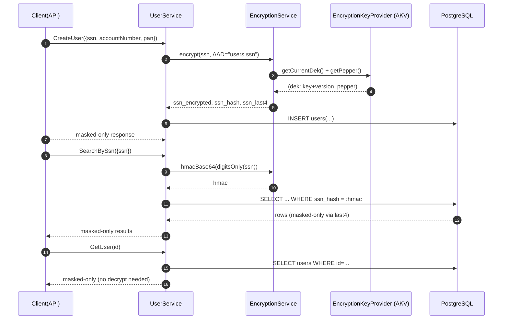

# Key Management (Option A — On-Demand Historical Key Fetch)


## 1) Purpose & Scope — What & Why

We protect PII/PCI at the **application layer** using **AES-GCM** and keep all cryptographic keys in **Azure Key Vault**. We chose **Option A** for historical keys:

* The **current** Data Encryption Key (**DEK**) and **pepper** (HMAC key) are kept in memory.
* **Historical DEKs are not cached**: when decrypting older rows, we fetch that **exact version from AKV on demand** (the version is inside each ciphertext header).
* This keeps **key residency in JVM minimal**, supports **zero-downtime rotations**, and makes **auditing simpler**.

> **Plain English:** Each encrypted value carries the **version** of the key it was encrypted with, so we can always fetch *that* version from AKV when decrypting. No big in-memory stash of old keys.

---

## 2) Core Concepts (Explained Simply)

* **PII**: Info that can identify a person (SSN, PAN, bank account).
* **PAN**: Card number, e.g., `4111111111111111`.
* **DEK**: **Data Encryption Key** (AES-256). Same key encrypts/decrypts (symmetric).
* **Pepper**: Secret key used for **HMAC**. Stored only in AKV. Not in DB.
* **AES-GCM**: Encryption + integrity (tamper detection).
* **IV**: Random 12-byte nonce per encryption. **Never reuse** with the same key.
* **AAD**: Additional Authenticated Data (not encrypted) used to **bind the ciphertext to a field**, e.g., `"users.ssn"`. If AAD changes, decryption fails.
* **HMAC-SHA-256**: Keyed hash using the **pepper**; we store Base64(HMAC(digitsOnly(value))) to enable **exact-match search without decryption**.
* **Normalization**: Cleaning input (e.g., `123-45-6789 → 123456789`) before HMAC and last-4.

---

## 3) Non-Negotiables (Do / Don’t)

**Do**

* Keep plaintext only in **request DTOs** during service method, then **clear it**.
* Encrypt PII using **AES-GCM** with **fresh IV** and **correct AAD** for each field.
* Store **three** things per PII field:
  `*_encrypted` (Base64 header+ciphertext), `*_hash` (HMAC for search), `*_last4` (for masked UI).
* Block PII in **URLs/headers/logs**; return **masked-only** values.
* Audit every PII action (actor, purpose, entityId, fields, success/failure, duration).

**Don’t**

* Don’t add plaintext columns (e.g., `ssn`, `pan`). Use `*_encrypted`, `*_hash`, `*_last4`.
* Don’t log DTOs with PII.
* Don’t reuse IVs.
* Don’t cache historical DEKs in memory (Option A).

---

## 4) Data Flow (Create / Search / Read)



> **Note:** Reads for masked UI **don’t decrypt**—they use `*_last4`.

---

## 5) Ciphertext Header (Byte-Level)

We store Base64 of this **binary** container in `*_encrypted`:

```
[ verLen ][ ver... ][ iv... ][ ct... ]
  1 byte   verLen B   12 B     N B
```

* **verLen**: 1 byte (0–255) — number of bytes in `ver`.
* **ver**: UTF-8 bytes of the **AKV secret version** (e.g., `ee7f0a1c-9f2b-...`).
* **iv**: 12 random bytes.
* **ct**: AES-GCM ciphertext **+** 16-byte tag.

### Worked Example

* `ver = "ee7f0a1c-9f2b-4e7e-9d2f-5a6c3b1d0eab"` → `verLen = 36 (0x24)`.
* `iv = A1 B2 C3 D4 E5 F6 01 23 45 67 89 AB` (12 bytes).
* `ct` = 48 bytes (example), last 16 bytes are the GCM tag.

Concatenation (hex schematic):

```
24
65 65 37 66 30 61 31 63 2D 39 66 32 62 2D 34 65 37 65 2D 39 64 32 66 2D 35 61 36 63 33 62 31 64 30 65 61 62
A1 B2 C3 D4 E5 F6 01 23 45 67 89 AB
<48 bytes of ct ...>
```

Then **Base64** the whole blob → store as TEXT.

### Why this is safe

* The header reveals **version** and **IV**, **not** the key.
* Without the DEK from AKV **and** the correct **AAD**, decryption fails (GCM tag mismatch).

---

## 6) Pseudocode

### Encrypt (per field)

```java
// Inputs: plaintext (String), aad (e.g., "users.ssn")
var secrets = keyProvider.current();                // has dek + version + pepper
byte[] iv = secureRandom(12);
Cipher c = aesGcm();
c.init(ENCRYPT_MODE, secrets.dek(), new GCMParameterSpec(128, iv));
c.updateAAD(aad.getBytes(UTF_8));
byte[] ct = c.doFinal(plaintext.getBytes(UTF_8));

// Build header [verLen|ver|iv|ct]
byte[] ver = secrets.dekVersion().getBytes(UTF_8);
ByteBuffer buf = ByteBuffer.allocate(1 + ver.length + 12 + ct.length);
buf.put((byte) ver.length).put(ver).put(iv).put(ct);
String encryptedBase64 = Base64.encode(buf.array());

// HMAC for search + last-4 for masking
String digits = digitsOnly(plaintext);
String hash = Base64.encode(HmacSHA256(secrets.pepper(), digits.getBytes(UTF_8)));
String last4 = right(digits, 4);
```

### Decrypt (on demand)

```java
// Inputs: encryptedBase64, aad (must match original)
byte[] raw = Base64.decode(encryptedBase64);
ByteBuffer buf = ByteBuffer.wrap(raw);

int verLen = buf.get() & 0xFF;
byte[] ver = new byte[verLen]; buf.get(ver);
byte[] iv = new byte[12]; buf.get(iv);
byte[] ct = new byte[buf.remaining()]; buf.get(ct);

var dek = keyProvider.dekByVersion(new String(ver, UTF_8)); // on-demand fetch from AKV
Cipher c = aesGcm();
c.init(DECRYPT_MODE, dek, new GCMParameterSpec(128, iv));
c.updateAAD(aad.getBytes(UTF_8));
String plaintext = new String(c.doFinal(ct), UTF_8);
```

> **If AAD is wrong** (`"users.pan"` instead of `"users.ssn"`), `doFinal` throws—this is expected and desired.

---

## 7) What Lives Where

| Thing                 | Where it lives                               | Why                                                    |
| --------------------- | -------------------------------------------- | ------------------------------------------------------ |
| **DEK** (AES-256)     | Azure Key Vault secret `pii-dek` (versioned) | Central control; audit; rotation without app redeploy. |
| **Pepper** (HMAC key) | AKV secret `pii-pepper` (versioned)          | Prevent offline rainbow tables on hashes.              |
| **Ciphertext**        | DB `*_encrypted` (Base64 of header + ct)     | App-level encryption (stronger than TDE alone).        |
| **Search hash**       | DB `*_hash` (Base64 HMAC)                    | Fast equality search without decryption.               |
| **Masked display**    | DB `*_last4`                                 | Display masked values without decryption.              |

---

## 8) Rotation Procedures

### A) Planned DEK Rotation (Zero Downtime)

**Goal:** New writes use the **new DEK**; old rows keep decrypting using their embedded version.

1. **Before (T-7 → T-1 days)**

    * Change ticket; owners; risk; rollback plan.
    * Verify AKV backups; pre-prod test: decrypt old rows *after* rotation.
    * Confirm crash/heap dumps disabled in prod.
    * Notify stakeholders.

2. **During (T-0)**

    * **AKV:** `setSecret("pii-dek", <new 32B key Base64>)` → creates **new version**.
    * App picks up **current** DEK on next refresh (or immediately if implemented).
    * New writes now include **new version** in the ciphertext header.
    * Monitor: AKV get/list success rate, latency, 429/5xx, app decrypt errors.

3. **After (T+1h)**

    * Write test row; confirm header uses **new version**.
    * Read old rows; confirm they decrypt.
    * Attach evidence (AKV version IDs, metrics) and close ticket.

> We **do not** delete old DEK versions immediately—old rows need them.

### B) Emergency DEK Rotation (Suspected Key Exposure)

* Immediately add **new DEK version**; ensure **no new writes** use the compromised version.
* Consider **targeted re-encryption** of high-risk data.
* Increase monitoring; document incident; review access policies.

### C) Optional Re-Encryption (Consolidate to Latest)

* Batch process: for each row, decrypt (fetch historical `ver`), re-encrypt with current DEK, fresh IV, update header+ct.
* Throttle + respect AKV limits; idempotent with “migrated” marker.
* Only needed if policy requires single active DEK across dataset.

---

## 9) Pepper (HMAC Key) Rotation — Only If Necessary

**Impact:** All `*_hash` values change. Searches break unless you migrate.

**Safe Plan (Dual-Hash Window):**

1. Add **new hash columns** or a version flag.
2. For new writes/updates, compute **both** old and new HMACs; search tries both.
3. Backfill: recompute hashes for existing rows with **new pepper**.
4. Flip search to **new hash only**; remove old columns/flag.

**Default:** Pepper rotations are **rare** (e.g., annually) or after suspected exposure.

---

## 10) Access Control & Networking

* **App identity** (MSI/SP): `secrets get/list`.
* **Custodians:** `secrets set/get/list/backup/restore`.
* **Break-glass:** PIM time-boxed, ticket required.
* **AKV** behind **private endpoints**, TLS 1.2+, firewall rules as needed.
* **No local files** for keys; no secrets in code or images.

---

## 11) Monitoring & SLOs

**AKV**

* `getSecret` success ≥ **99.9%** (rolling hour).
* P95 latency ≤ **150 ms** (same region, private link).
* 429/5xx alert if > **0.5%** over 5 min.

**App**

* Decrypt failures alert immediately.
* Count of decrypts using **historical versions** (watch spikes post-rotation).
* Rate-limit blocks, URL/response PII guard violations.
* Error budget for PII endpoints ≤ **0.1%** 5xx.

**Audit/Compliance**

* Every PII action recorded (purpose, actor, entityId, fields).
* Daily job checks “no missing audit rows” for PII endpoints (heuristic).

---

## 12) Crash / Heap Dump Risk (Keys in RAM)

**Prevent**

* Disable core dumps: `ulimit -c 0`.
* Avoid `-XX:+HeapDumpOnOutOfMemoryError` in prod.
* Harden container (drop `SYS_PTRACE`, read-only FS).

**If a dump may exist**

1. Treat dump as **cardholder data**; isolate.
2. **Rotate DEK** (new version).
3. Consider re-encryption for affected rows.
4. Review AKV & app logs; document and remediate.

---

## 13) Compliance Mapping (Plain Words)

* **PCI DSS 4.x**

    * **3.4/3.5.1**: PAN unreadable via **AES-GCM**; app-level keys in AKV; versioned rotation.
    * **3.3**: Mask PAN in UI (BIN+last-4).
    * **3.2.x**: We do **not** store SAD (CVV, PIN, track).
* **GDPR Art. 25/32**: Encryption at rest, minimal disclosure (masked only), purpose-bound audit.
* **Evidence**: SOP (this doc), rotation tickets, AKV audit logs, tests proving no plaintext in DB/URLs/logs.

---

## 14) Pitfalls & Fixes

* **“I added a `ssn` column to make reporting easier.”**
  ❌ Not allowed. Use `ssn_encrypted`, `ssn_hash`, `ssn_last4`. We have DDL guard triggers to block this.

* **“I logged the whole DTO to debug.”**
  ❌ Never. Log request IDs, not PII. Use the audit trail.

* **“Decrypt to show full PAN for admins?”**
  Default is **masked-only**. If absolutely required, implement a **separate, step-up** endpoint with re-auth, fine-grained roles, strict audit, short-lived reveal, and no client-side storage.

* **“I reused the IV for consistency.”**
  ❌ Never reuse IVs with GCM. Always generate fresh 12-byte IV.

---

## 15) Quick How-Tos

### Generate new DEK (locally to then set in AKV)

```bash
# 32 random bytes → Base64 (store this *value* in AKV as the secret payload)
openssl rand -base64 32
```

### Set new DEK version in AKV

```bash
az keyvault secret set --vault-name <kv> --name pii-dek --value "<Base64Key>"
```

### Set Pepper in AKV

```bash
openssl rand -base64 32 | \
xargs -I{} az keyvault secret set --vault-name <kv> --name pii-pepper --value "{}"
```

> **Tip:** Keep the **version IDs** in the change ticket. Never store the raw key/pepper outside AKV.

---

## 16) Worked Example (End-to-End)

**Input:** SSN `123-45-6789`

1. Normalize → `123456789`
2. HMAC (pepper) → Base64 → `ssn_hash`
3. last-4 → `6789`
4. AES-GCM (AAD=`"users.ssn"`) → `ct+tag`
5. Header → `[verLen|ver|iv|ct]` → Base64 → `ssn_encrypted`
6. Save row: `{ ssn_encrypted, ssn_hash, ssn_last4 }`
7. Read for UI → **masked**: `***-**-6789` (no decrypt)

---

## 17) SOP Checklists

### Quarterly DEK Rotation

* [ ] Change ticket + approvals
* [ ] AKV health & backup verified
* [ ] Pre-prod: on-demand decrypt validated
* [ ] **AKV setSecret** → new version created
* [ ] App writes now carry new `ver` in header
* [ ] Old rows decrypt fine
* [ ] Evidence attached (AKV version IDs, latency/error charts)
* [ ] Sign-off by Custodian & App Owner

### Emergency DEK Rotation

* [ ] Incident P1 opened
* [ ] New DEK version created
* [ ] Monitor decrypts; consider re-encrypt
* [ ] Postmortem & policy tightenings

### Pepper Rotation (rare)

* [ ] Dual-hash schema/flags ready
* [ ] New writes compute both hashes
* [ ] Backfill existing rows
* [ ] Cut over searches to new hash only
* [ ] Remove old hash

---

## 18) FAQ (Fast)

* **Why use current key over caching old keys?**
  Less key residency in memory → safer if a dump occurs. The slight latency on first decrypt of an old row is acceptable.

* **Is disk/TDE enough?**
  No. PCI expects rendering PAN unreadable beyond TDE. We encrypt at the **application field level**.

* **Does the header leak secrets?**
  No. Header has version and IV (both non-secret). Decryption still requires the **key** and **AAD**.

* **What does AAD mean (not Azure AD)?**
  **Additional Authenticated Data**—crypto term. It binds ciphertext to a context string like `"users.pan"`.

---

## 19) Appendix — Field ↔ AAD Map (Authoritative)

| Field          | AAD (exact string) |
| -------------- | ------------------ |
| SSN            | `users.ssn`        |
| Account Number | `users.account`    |
| PAN            | `users.pan`        |

> **Do not change these** once data is written; it will break decryption for existing rows.

---

## 20) Appendix — Demo Notes (Emulator)

* For demos, use the **AKV Emulator in Docker** with seeded secrets.
* `POST /demo/keys/rotate` creates a new DEK version in the emulator to show **header `ver` switching** on new writes while **old rows still decrypt** via on-demand fetch.

---

### Final Reminder

* Entities are **ciphertext-only**.
* Responses are **masked-only**.
* Request DTOs may briefly hold plaintext—but **only long enough** to **normalize → HMAC → last-4 → encrypt**, then **clear**.

If anything in code deviates from this SOP, call it out in PR review—this is one of those areas where **small shortcuts become big incidents**.
