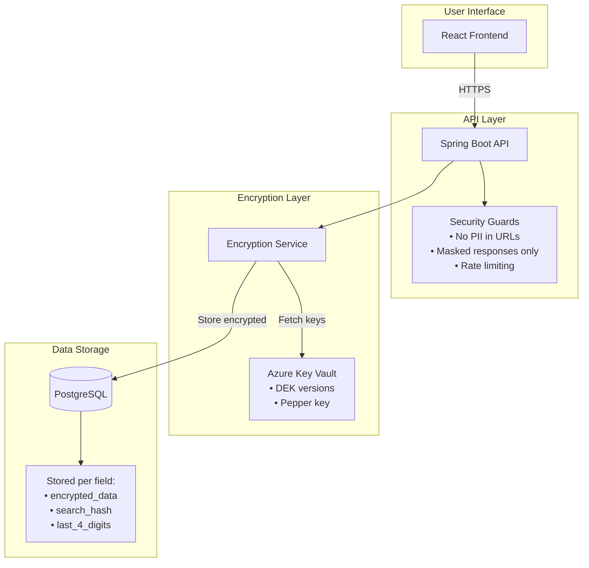

# PII/PCI Protection System Design using Application Layer Encryption


# Introduction

## 1) What problem are we solving?

Protect **PCI/PII** so it remains **unreadable to unauthorized parties**—including if databases, replicas, backups, exports, or logs are exposed—while complying with **PCI DSS** (e.g., render PAN unreadable) and **privacy laws** (e.g., GDPR Art. 32: appropriate technical measures). Practically, we must:

* Keep sensitive data confidential across all storage and movement paths.
* Support business needs (lookups, reporting, masked display) **without exposing plaintext** by default.
* Enforce secure defaults (no plaintext in APIs, URLs, or logs) with **auditable** controls.
* Allow **evolution of protective controls over time** (e.g., replace/upgrade mechanisms if risks change) **without data loss** and with minimal disruption.

## 2) What options exist besides encryption—and why choose encryption?

* **Tokenization/Vaulting**: Replaces values with tokens stored in a separate vault; strong isolation but adds a dependency and can complicate analytics. Often complements encryption.
* **Masking/Redaction-only**: Output control only; does **not** protect stored data.
* **Hashing-only**: Irreversible; fine for equality checks, unusable when the original value is needed.
* **DB/Tablespace crypto (e.g., TDE) or in-DB functions**: Helps with media theft; does **not** stop authorized DB users or SQL exfiltration.
* **Access control & monitoring alone**: Necessary but **insufficient** if plaintext can still be read.

**Why encryption (application-level)?**
It’s the only approach that **renders data unreadable everywhere it resides** while letting the application (a) provide masked views, (b) support **equality search** via keyed hashes, and (c) keep cryptographic material **outside the database** with independent governance—aligning with PCI’s “render unreadable” mandate and GDPR’s expectation of appropriate technical controls.

## 3) How does the encryption work (high level)?

* **Where**: At the **application layer** before data reaches the DB.
* **How**: **AES-256-GCM (AEAD)** with **Additional Authenticated Data (AAD)**—a stable per-field label that binds ciphertext to its column context. Each stored value is Base64 of **`[verLen | ver | iv | ct]`** (version, 12-byte IV, ciphertext+tag).
* **Search**: A separate indexed column stores **Base64(HMAC-SHA-256(normalized value, secret “pepper”)** for **equality** lookups (no decryption).
* **Display**: Store **derived last-4** for masked UI (e.g., `***-**-6789`) so most reads avoid decryption.
* **Control evolution**: Keys and hashing “pepper” are managed in an external service (e.g., Azure Key Vault) with **versioning** so protections can be **changed or replaced** later without rewriting existing data.

# Design Overview

To protect PCI/PII end-to-end and meet PCI DSS/GDPR expectations, we combine **application-layer encryption** with explicit **leak-prevention controls** around APIs, URLs, and logs:

1. **Field-level encryption (core)**

    * **Where:** Application layer, before data touches the DB.
    * **How:** **AES-256-GCM (AEAD)** with **AAD** per field (e.g., `"users.ssn"`). Stored as Base64 of **`[verLen | ver | iv | ct]`** so the ciphertext self-describes the **Key Vault version**.
    * **Why:** Renders data unreadable everywhere it lives (DB, replicas, backups, exports).

2. **Search without decryption**

    * **How:** Store **Base64(HMAC-SHA-256(normalized value, pepper))** in a separate indexed column.
    * **Why:** Enables equality lookups (e.g., SSN/PAN) without exposing plaintext.

3. **Masked display by default**

    * **How:** Store **derived last-4** per field (e.g., `6789`) and render masked values (`***-**-6789`, `**** **** **** 1111`).
    * **Why:** Most reads avoid decryption entirely; safer and faster.

4. **PII in URL guard (hard block)**

    * **Policy:** **No PII in query strings or “custom” headers.** Accept sensitive input only in POST/PUT bodies.
    * **Mechanism:** A lightweight request filter that **rejects** requests containing SSN/PAN/account patterns in the URL or forbidden headers (HTTP **400** with a safe error).
    * **Why:** URLs are widely logged/cached by proxies, gateways, and browsers.

5. **Log sanitizer (redaction)**

    * **Policy:** Never log DTOs or raw request/response bodies for PII endpoints.
    * **Mechanism:** A log **message converter/filter** that redacts SSN/PAN/account patterns; **disable SQL/parameter logging** in production; ensure MDC and exception messages pass through the sanitizer.
    * **Why:** Prevent leakage through application logs and third-party appenders.

6. **Response payload guard**

    * **Policy:** API must not return plaintext fields such as `ssn`, `accountNumber`, `pan`.
    * **Mechanism:** An outbound response filter that inspects JSON keys and **blocks** responses containing forbidden fields; only masked fields (e.g., `ssnMasked`) are allowed.
    * **Why:** Stops accidental exposure from mis-mapped DTOs or debug code.

7. **Immutable auditing (visibility & accountability)**

    * **What:** **Append-only** `audit_log` with actor, purpose, action, entityId, fields accessed, success/error, requestId.
    * **Mechanism:** AOP aspect around PII endpoints to record **who did what and why**, without logging plaintext values.
    * **Why:** Evidence for compliance and incident response.

8. **Key governance (enable change without data loss)**

    * **Where:** **Azure Key Vault** for **DEK** and **pepper** with versioning.
    * **How:** Ciphertext embeds the **key version**; decrypt fetches the right version on demand; new writes use the latest version.
    * **Why:** Allows safe evolution of protections (rotations, algorithm changes) with **zero downtime**.

9. **Frontend hygiene (supporting controls)**

    * **Rules:** Never place PII in URLs, never persist in local/session storage, auto-clear PII inputs on idle/unmount, and display **masked-only** values by default.

**Control flow (at a glance):**

* **Inbound:** Client → **URL-PII Guard** → Controller → Service (**normalize → HMAC → last-4 → encrypt**) → Repository.
* **Outbound:** Repository → Service → Controller → **Response Guard** → Log Sanitizer → Client.

This layered approach ensures that even if one boundary fails (e.g., a misconfigured logger or a leaked SQL dump), **other controls still prevent plaintext exposure**, delivering a pragmatic, production-ready design beyond encryption alone.

## Overview
This design describes a field-level encryption system for protecting Personally Identifiable Information (PII) and Payment Card Information (PCI) in any application. The system uses application-level encryption with keys stored in Azure Key Vault, providing defense-in-depth security beyond database encryption.

Additional Features include:
- **Append only Audit Log** that records who did what to each sensitive PII/PCI field
- **Log Sanitizer** that prevents sensitive PCI/PII fields from being output into logs
- **PII Guards** that prevent leaking of sensitive PII/PCI fields in API requests from Front-ends

## Assumptions

### System Landscape & Topology

 - 3-tier architecture: React SPA (frontend) → Spring Boot API (backend) → PostgreSQL (database).

 - All communication is over TLS; the environment provides valid certificates.

 - Backend is stateless behind an API gateway or load balancer.

 - PostgreSQL Database is available and managed (backups, HA, etc.)

### Business Context

 - The system must comply with PII, PCI DSS (cardholder data) and GDPR (personal data).

 - Sensitive authentication data (e.g., CVV, PIN, track data) will not be stored.

 - Display of PII/PAN to end users is masked by default; full reveal (if ever needed) is rare and tightly controlled by business policy.

 - The application handles user onboarding, lookup, and account servicing that require storing and retrieving identifiers like SSN, bank account number, and PAN.

 - Equality search on sensitive identifiers (e.g., “find user by SSN”) is required.

 - Fuzzy/partial/range searches on PII are not required.

### Cryptography & Key Management Capabilities

 - Azure Key Vault (AKV) is available in each environment with:

    * Secret versioning, soft-delete, and purge protection enabled.
    * Application identity (managed identity/service principal) able to get/list required secrets.
    * Network connectivity from the API tier to AKV is reliable and meets latency/throughput needs.

### Security & Access Control Posture

 - Centralized authentication and authorization exist and are enforced at the API/backend layer (exact details out of scope).
 - Least-privilege access controls are enforceable for the app’s DB user and Azure Key Vault identity.
 - Production environments disable JVM/core dumps (or treat them as highly sensitive).
 - No PII is allowed in URLs or HTTP headers per enterprise security policy.

## Application-Level Encryption Instead of Database Encryption Options

Application-level encryption was chosen over PostgreSQL TDE or pgcrypto because
- TDE(Transparent Data Encryption) only protects data at rest on disk and in backups - anyone with database access still sees plaintext, making it insufficient for PCI compliance and vulnerable to SQL injection or compromised credentials. 
- The pgcrypto extension would require passing encryption keys through SQL queries where they could be logged or cached, creates a messy trust boundary where the database handles both data and keys, and makes key rotation operationally complex. 

By encrypting at the application layer,
- Maintain clean separation between keys (in Azure Key Vault) and data (in PostgreSQL)
- Enable granular field-level protection with proper key versioning for zero-downtime rotation,
- Implement secure search of PII/PCI data through HMAC hashing without exposing PII or PCI data within any of the application layers - front-end, app layer and database

This allows the design to be database-agnostic and audit-friendly for compliance requirements.

## 1. Core Concepts

This design protects PII/PCI data through field-level encryption with three components stored for in the database for each sensitive field:
- **Encrypted data** with embedded key version for rotation support
- **HMAC hash** for searching without decryption
- **Last 4 digits** for masked display without decryption


### What We're Protecting - Example
- **PII (Personally Identifiable Information)**: Data that can identify a specific person
    - SSN (Social Security Number): Format `123-45-6789`
    - Bank Account Numbers: 10-12 digit identifiers
- **PCI (Payment Card Industry) Data**:
    - PAN (Primary Account Number): The 16-digit card number
    - **NOT storing**: CVV, PIN, or magnetic stripe data (prohibited by PCI DSS)

### How We Protect It - Three Layers
1. **Encryption**: Converting readable data into unreadable ciphertext
2. **Hashing for Search**: Creating a searchable fingerprint without storing the actual value for fast searches from the UI
3. **Masking for Display**: Showing only the last 4 digits (e.g., `***-**-6789`)

### Key Encryption Terms used for encrypting PII/PCI fields
- **DEK (Data Encryption Key)**: The actual AES-256 key that encrypts your data
- **Pepper**: A secret key used for generating search hashes (prevents rainbow table attacks)
- **AAD (Additional Authenticated Data)**: A label that "locks" encrypted data to its intended location
- **IV (Initialization Vector)**: A unique random value for each encryption operation
- **HMAC (Hash-based Message Authentication Code)** is a keyed hash: a cryptographic checksum that combines a secret key with a message via a hash function to prove integrity and authenticity.

## 2. Architecture Overview



## 3. How does Encryption Work? (Step-by-Step)

### When Saving PII (e.g., SSN "123-45-6789")

1. **Normalize**: Remove formatting → `123456789`
2. **Create Search Hash**: `HMAC(pepper_key, "123456789")` → Base64 string
3. **Extract Display Mask**: Last 4 digits → `6789`
4. **Encrypt Original Value**:
   ```
   - Generate random 12-byte IV
   - Set AAD = "users.ssn" (field identifier)
   - Encrypt with AES-256-GCM
   - Create header: [version_length][key_version][IV][ciphertext]
   - Encode as Base64
   ```
### Database Storage:
   
    Each PII field gets three columns:
```sql
ssn_encrypted TEXT,        -- Base64(header + encrypted data)
ssn_hash VARCHAR(64),      -- Base64(HMAC) for searching
ssn_last4 VARCHAR(4)       -- For masked display
```
### The Ciphertext Header - Encrypted value in the database field

Every encrypted value starts with:
```
[1 byte: version length][N bytes: key version][12 bytes: IV][rest: encrypted data]
```
Example for version "abc-123" (7 characters):
```
07 | 61 62 63 2D 31 32 33 | [12 random bytes] | [encrypted data + 16-byte auth tag]
```

This design ensures:
- We always know which key version to use for decryption
- Each encryption has a unique IV
- The authentication tag detects tampering

### When Searching for PII
1. Normalize search input
2. Generate HMAC with pepper key
3. Query database: `WHERE ssn_hash = ?`
4. Return masked results (no decryption needed)

### When Rotating Encryption Keys
1. Create new key version in Azure Key Vault
2. New encryptions use new version
3. Old data still decrypts (version is in the header)
4. Optional: Re-encrypt old data over time


## 5. Database Schema assume SSN, account number and PAN are the sensitive fields

```sql
CREATE TABLE users (
    id BIGINT PRIMARY KEY,
    
    -- Regular fields
    email VARCHAR(255) NOT NULL UNIQUE,
    first_name VARCHAR(100),
    last_name VARCHAR(100),
    
    -- PII fields (three columns each)
    ssn_encrypted TEXT,              -- Base64(header + ciphertext)
    ssn_hash VARCHAR(64),            -- Base64(HMAC for search)
    ssn_last4 VARCHAR(4),            -- Last 4 digits only
    
    account_number_encrypted TEXT,
    account_number_hash VARCHAR(64),
    account_number_last4 VARCHAR(4),
    
    pan_encrypted TEXT,
    pan_hash VARCHAR(64),
    pan_last4 VARCHAR(4),
    
    created_at TIMESTAMPTZ DEFAULT CURRENT_TIMESTAMP,
    updated_at TIMESTAMPTZ DEFAULT CURRENT_TIMESTAMP
);

-- Only index the hash columns for searching
CREATE INDEX idx_ssn_hash ON users(ssn_hash);
CREATE INDEX idx_account_hash ON users(account_number_hash);
CREATE INDEX idx_pan_hash ON users(pan_hash);
```

## 6. Security Controls

### What's Blocked
- ❌ PII in URLs (query parameters, path variables)
- ❌ PII in HTTP headers
- ❌ Plaintext PII in API responses
- ❌ PII in application logs
- ❌ Direct database access to PII

### What's Required
- ✅ JWT authentication with scopes
- ✅ Recent authentication for modifications (15-minute window)
- ✅ Rate limiting (100 reads/min, 10 writes/min)
- ✅ Audit logging of all PII access
- ✅ Purpose-of-use header (X-Audit-Purpose)

## 7. Developer Guidelines

### DO:
- Use the provided `EncryptionService` for all PII operations
- Clear sensitive data from memory after processing
- Use POST for searches (never GET with PII)
- Return only masked values in API responses
- Test with synthetic data in development

### DON'T:
- Create plaintext database columns for PII
- Log request/response bodies containing PII
- Put PII in exception messages
- Cache decrypted values
- Reuse the same IV for multiple encryptions

## 8. Common Operations

### Creating a User
```java
// Controller receives request
CreateUserRequest request = {ssn: "123-45-6789", ...}

// Service encrypts PII
EncryptedField ssnField = encryptionService.encrypt(request.getSsn(), "users.ssn");

// Store all three values
user.setSsnEncrypted(ssnField.encrypted);
user.setSsnHash(ssnField.hash);
user.setSsnLast4(ssnField.last4);

// Return masked response
return UserResponse {ssnMasked: "***-**-6789"}
```

### Searching by SSN
```java
// Normalize and hash the search value
String normalized = normalizeDigits(searchSsn);
String searchHash = encryptionService.generateHmac(normalized);

// Query by hash (no decryption)
List<User> results = repository.findBySsnHash(searchHash);

// Return masked results
return results.map(u -> maskResponse(u));
```


